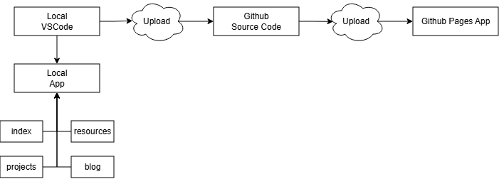

# Project Echo

Project Echo organizes my work into a clear, visual portfolio you can browse easily

## Skillset

| Area          | Highlights                                         |
| ------------- | -------------------------------------------------- |
| Frontend      | Semantic HTML5, Responsive CSS, Bootstrap 5        |
| Programming   | JavaScript (ES6), DOM APIs, Fetch API              |
| Data          | JSON structuring, lightweight data modeling        |
| Tooling       | Git, GitHub Pages, DevTools (Network/Elements)     |
| Accessibility | W3C Nu Validator, WAVE reports                     |
| Documentation | Markdown, Architectural reflection, Issue tracking |

## Architecture & Infra Overview

Infrastructure = tools, libraries, services powering delivery; Architecture = how they interact.

